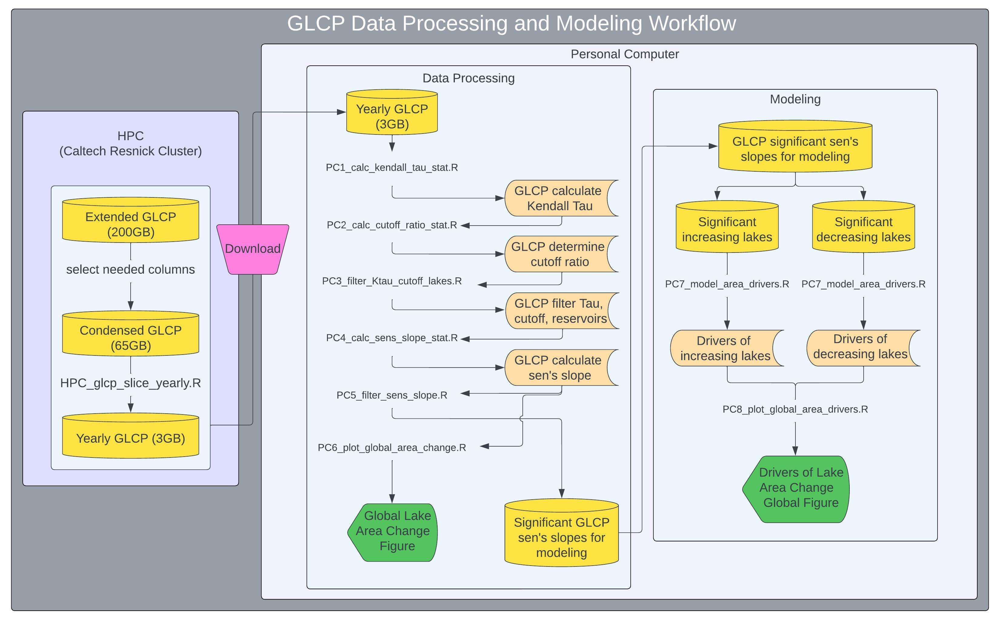

# Global-Lake-Area-Analysis
-----

:busts_in_silhouette: Ryan McClure, Alli Cramer, Steve Katz

:busts_in_silhouette: Special thanks to: Michael Meyer, Stephanie Hampton, Xiao Yang, Salvatore Virdis, Matthew Brousil

Questions?  :email: rmcclure@carnegiescience.edu

## Motivation

Thank you for checking out the GLCP analysis workflow. Lakes globally are both increasing and decreasing in size as a result of changing climate and human pressure. However, both the magnitude and spatial variation of how waterbody area is changing has been restricted to regional assesments and has not yet been quantified for lakes globally.

We developed a workflow that analyzes the magnitude and direction of lake area change for 1.4+ million lakes globally. We then isolated lakes that were increasing and decreasing in area and then modeled the the most important drivers of lake area change. This is one of the first globally-scaled attempts to partition how lake area is changing and then isolate the most important predictors of that change.

### RUN THE WHOLE WORKFLOW ON myBinder
** TESTING DONT FOLLOW LINK YET **
Follow the myBinder link:

-----

## WORKFLOW ON THE CalTech HPC
### A. How to Login to the CalTech HPC on Terminal and WinSCP
1. Open terminal
2. Type ssh “yourname”@login.hpc.caltech.edu
3. Type your password when asked
4. When prompted, type <i>1</i>, which sends prompt to DUO
5. Open DUO on Phone and hit the GREEN checkmark. **This same method is used for WinSCP or Fetch**

### B. How to Get the newest GLCP data product from Kamiak to CalTech
<b>NOTE - skip this whole step if you have the newest data product</b>

Because MFM is still modifying the GLCP on Kamiak, we need to transfer the newest data over to the CalTech Cluster

1. When you have logged into terminal run the following command:

<i>rsync -av --progress “firstname.lastname”@kamiak.wsu.edu:/path/to/data/on/kamiak /central/groups/carnegie_poc/”yourname”/location/you/want/data/to/go</i>

In principle, you’re using rsync to pull data from kamiak to CalTech. You will need your Kamiak and Caltech login credentials ready 
Let this run until completion. This can take upwards of an hour for the whole GLCP_extended.csv depending on your connection. 

### C. Getting the needed packages to process GLCP in R on CalTech HPC
1. Open terminal and login using the prior login directions
2. Type: <i>module load gcc/9.2.0</i>
3. Type: <i>module load R/4.2.2</i>
4. Type: <i>R</i>
5. R will now open in terminal
6. Type: <i>install.packages(“dplyr”,”tidyr”,”vroom”,”readr”,”feather”)</i>
7. R will ask you where you want to download from, I chose 71.
8. When finished, type <i>q()</i>
9. Then type <i>n</i> and hit enter. 
10. These packages are now installed on your domain in the Caltech Cluster

### D. Subsetting the GLCP database to include ONLY the columns we are interested in. 
The GLCP_extended is huge and we don’t need all of the columns. We use <i>cut</i> command in Shell select the columns we need.

1. Open Terminal
2. Navigate to the directory that has the original <i>GLCP_extended.csv</i> data product
3. Type the following command:

<i>cut -d "," -f1,3,4,5,7,8,11,12,13,15,18,19,31 glcp_extended.csv > glcp_extended_thin.csv</i>

These columns are 1=year, 3=hylak_id, 4=centr_lat, 5=centr_lon, 7=country, 8=bsn_lvl, 11=total_precip_mm, 12=mean_annual_temp_k, 13=pop_sum, 15=permanent_km2, 18=lake_type, 19=lake_area, 31=sub_area

5. Let this command run through completion without touching <b>anything</b> in the terminal (~15 minutes)
6. When this command completes, the GLCP should go from ~200 GB to ~ 30 GB

### E. Condense GLCP to yearly values from the glcp_extended_thin.csv

1. Manually upload the <i>D1_glcp_slice_yearly.R</i> and <i>glcp_data_wrangle.sh</i> that are located in <i>/scripts/HPC_scripts/</i> on Github into a working directory of your choice on the CalTech Cluster (Use either WinSCP or Fetch)
2. <b>MAKE SURE YOU PROPERLY UPDATE YOUR DIRECTORIES in these two files</b>
3. Open terminal
4. Navigate to the path where <i>D1_glcp_slice_yearly.R</i> and <i>glcp_data_wrangle.sh</i> are located on the HPC
5. When there, type the following command:

<i>sbatch glcp_data_wrangle.sh</i>

6. Use <i>squeue -u your.login.name</i> to receive updates (It will also email you)
7. Depending on how quickly you get your job to start (seconds to days) the run itself should be no more than 2 hours (my latest run was 55 minutes)
8. When run is completed, you will get an emailthere will be an output file named <i>D1_glcp_yearly_slice.feather</i>
9. Download this file onto your personal computer (It should be no more than 4 GB)

## WORKFLOW ON PERSONAL COMPUTER
## Cloning Global-Lake-Area-Analysis repo onto your computer (5 steps)
1. Go to the [Global-Lake-Area-Analysis](https://github.com/ryanmclake/Global-Lake-Area-Analysis) repository and copy the repo URL. 
2. Open RStudio
3. Start a new project: File > New Project
4. Select: Version Control > Git
5. Paste the repo's URL into "Repository URL:", keep the project directory name as the default, select "open in new session", and click <b>New Project</b>

### Navigate to the <i>PC_scritps</i> folder and open the following scripts
1. <i>01_Data_Compile.R</i>
2. <i>02_model_training.R</i>
3. <i>03_Generate_Forecasts.R</i>
4. <i>04_Forecast_Evaluations.R</i>

